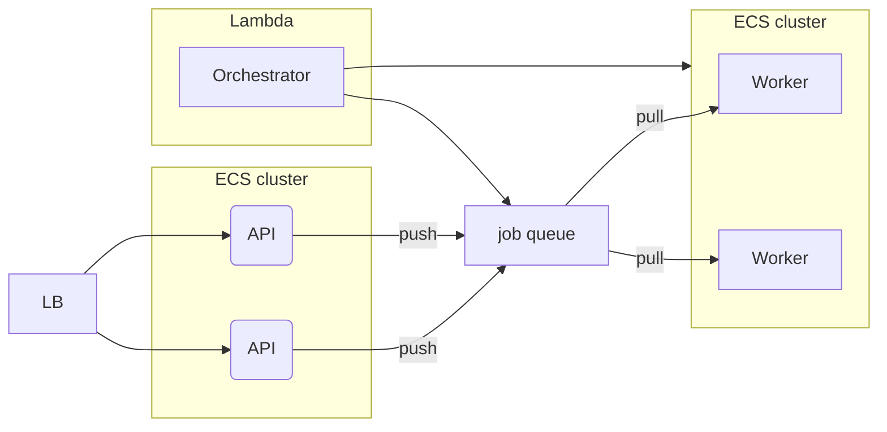

# Description

This repository contains an example of a simple architectural solution on AWS for a typical data-analytics application. The use case can be described as:

"An application has REST API to post data, launch analysis jobs on this data, and get the result. Analysis job consumes a lot of memory and CPU resources and can take up to 30 minutes to finish. Clients launch analysis jobs unpredictably and can launch multiple jobs at once causing load spikes. We need to design an auto-scalable and cost efficient architecture of such application."

# Architecture



To read about why we choose this architecture check [here](https://github.com/pavradev/blog/tree/main/content/001-aws-architecture-for-data-analytics-app).

# Repository structure

This repository is structured as monorepo and fully self-contained.

- [api](./api/README.md) repository contains `api` service code
- [worker](./worker/README.md) repository contains `worker` service code
- [orchestrator](./orchestrator/README.md) repository contains `orchestrator` code
- [infrastructure](./infrastructure/README.md) repository contains terraform configuration that deploys AWS infrastructure components

# Running locally

You need `docker` with docker-compose to run locally. From the root folder run

```
    docker-compose build
    docker-compose up -d
```

To check logs

```
    docker-compose logs -f
```

To shut down local environment run

```
    docker-compose down
```

We use [localstack](https://github.com/localstack/localstack) to simulate AWS job-queue locally. Also note that `orchestrator` is not started when running locally. Insteat, docker-compose itself will make sure that 1 instance of `woker` is always running.

# Running on AWS

>:warning: AWS charges might be applied to your accout, but we use the cheapest resources possible so the total cost should not exceed 1$ for 1 day.

1. Set up AWS account (if you don't have one) and create user with programmatic access and admin access to your AWS account. We are going to use this credentials in github actions to automatically set up the environment.
2. Fork this github repository to your account. Then go to the repository -> settings -> secrets -> actions and add the following parameters from your AWS account:

- `AWS_ACCESS_KEY_ID` - from step 1
- `AWS_SECRET_ACCESS_KEY` - from step 1
- `AWS_ACCOUNT_ID` - you can copy it from the top left corner when you log in to your AWS console
- `AWS_DEFAULT_REGION` - pick up whatever is closest/cheapest for you. I use `eu-west-1`

3. Launch `Init AWS environment` github action. It creates s3 bucket for terraform state and tree ECR repositories for `api`, `worker`, and `orchestrator`. Then it builds all three services and finally deploys entire AWS infrastructure using terraform.

>:warning: If you created your AWS account recently, you need to manually launch an EC2 instance to remove account limitations [give reference]. You can destroy the instance once you receive an email from AWS about acount activation.

Once the action is complete it will print `api_url` at the end of the console output of `Create AWS resources` step. Otherwise you can go to your AWS account -> EC2 -> Load balancers and check DNS name there. Go to your browser and type http://<api_url> to check that the api service is online.

4. To destroy all AWS resources launch `Destroy AWS environment` github action.