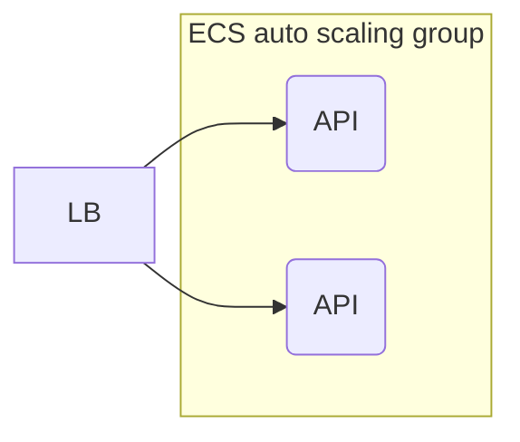
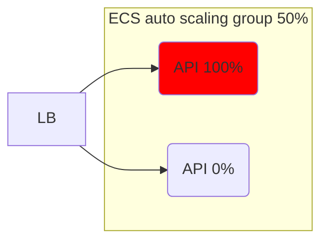
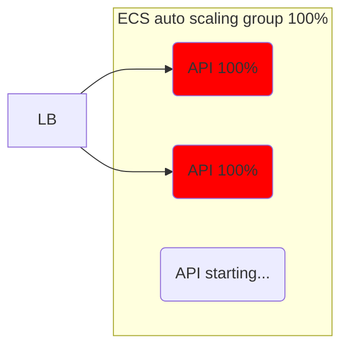
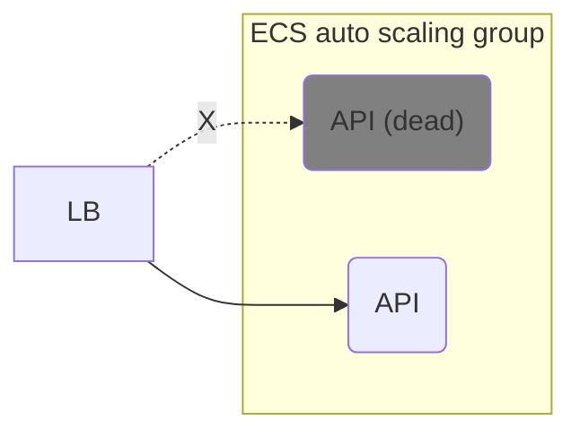
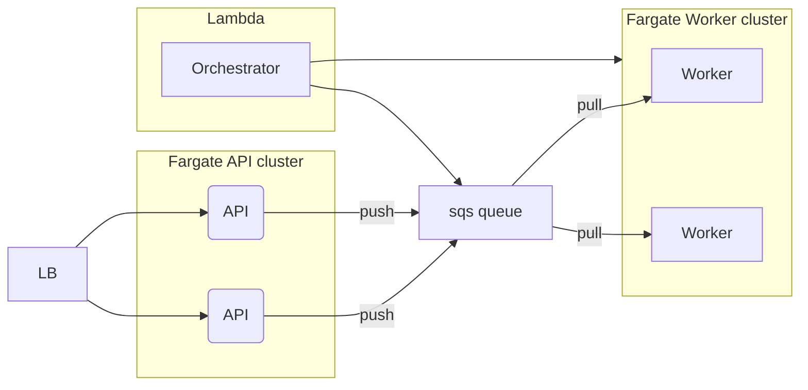

# data-analytics-app-architecture-aws

An simple example of auto-scalable and cost-efficient architecture for a data analytics application on AWS. 

## Use case

An application has REST API to post data, launch analysis jobs on this data, and get the result. Analysis job consumes a lot of memory and CPU resources and can take up to 20 minutes to finish. Clients launch analysis jobs unpredictably and can launch multiple jobs at once causing load spikes. We need to design an auto-scalable and cost efficient architecture of such application.

## Monolyth straitforward solution (bad)

We can simply build a monolyth application and lauch it in ECS auto-scaling group. Auto-scaling group will scale up or down our application depending on resource usage. 

However such approach has several disadvantages

### 1. Uneven instance load

We can get unlucky and majority of the jobs en up on one instance. Since job resource consumption is unproportionally heavy compared to processing REST requests, instance performance will degrade heavily. Even thoug one instance is running on the edge consuming 100% of resources, from the cluster perspective only 50% of resources are consumed so scale-up does not happen. This can result in slow response times for requests that keep hitting the loaded instance and eventually the cluster can kill instance if it stops sresponding. This will result in job loss.

### 2. Slowdown on a spike

Even if jobs are distributed evenly, we can fill all instances' capacity quckly during job spike. This will result in slow response times while auto-scaling group brings alive new instances (which can take minutes). If we get unlucky the cluster kills some instances which results in job loss like in the previous example.

### 3. Job loss on random instance failure

Even if jobs are distributed evenly and we dont get heavy job spikes, we can still loose submitted jobs. AWS explicitly says that ECS instances might die time to time, which means we can loose unfinished jobs. 

## Split into 2 services (better)

## Split into 2 services and orchestrator (best)

Here we emmidiatly run into a limitation of lambda runtime: the longest AWS lambda can run is 15 min. Some of our heavy jobs will never be finished.

