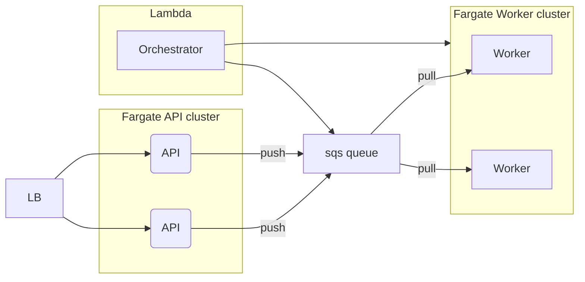

# data-analytics-app-architecture-aws
Auto-scalable and cost-efficient architecture for a data analytics application on AWS

```mermaid
  flowchart LR
  lb[LB] --> api1(API) & api2(API) --push--> q1
  subgraph c1 [Fargate API cluster]
      api1
      api2
  end
  q1[sqs queue] --pull--> w1[Worker] & w2[Worker]
  subgraph c2 [Fargate Worker cluster]
      w1
      w2
  end
  subgraph l[Lambda]
      l1[Orchestrator]
  end
  l1[Orchestrator] --> c2 & q1
```
