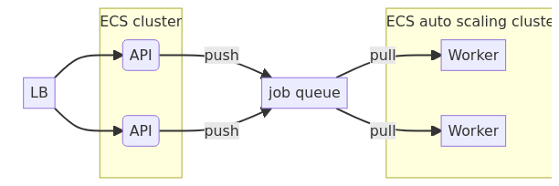

# data-analytics-app-architecture-aws

An simple example of auto-scalable and cost-efficient architecture for a data analytics application on AWS. 

## Use case

An application has REST API to post data, launch analysis jobs on this data, and get the result. Analysis job consumes a lot of memory and CPU resources and can take up to 20 minutes to finish. Clients launch analysis jobs unpredictably and can launch multiple jobs at once causing load spikes. We need to design an auto-scalable and cost efficient architecture of such application.

## First approach: Monolyth straitforward solution

We can simply build a monolyth application and lauch it in ECS auto-scaling group. Auto-scaling group will scale up or down our application depending on resource usage. 

However such approach has several disadvantages

### 1. Uneven instance load

We can get unlucky and majority of the jobs en up on one instance. Since job resource consumption is unproportionally heavy compared to processing REST requests, instance performance will degrade heavily. Even though one instance is running on the edge consuming 100% of resources, from the cluster perspective only 50% of resources are consumed so scale-up does not happen. This can result in slow response times for requests that keep hitting the loaded instance and eventually the cluster can kill instance if it stops responding. This will result in job loss.

### 2. Slowdown on jobs spike

Even if jobs are distributed evenly, we can fill all instances' capacity quickly during job spike. This will result in slow response times while auto-scaling group brings alive new instances (which can take minutes). If we get unlucky the cluster kills some instances which results in job loss like in the previous example.

### 3. Job loss on random instance failure

Even if jobs are distributed evenly and we don’t get heavy job spikes, we can still loose submitted jobs. AWS explicitly says that ECS instances might die time to time [add reference], which means we can loose unfinished jobs. 

## Second approach: split into 2 services

This architecture is much better, since we can scale workers independently and they will not slow down our API. We now use a job queue so jobs will never be lost even if worker dies for some reason. And yet there is still a problem.

### 1. Job termination during scale-down

When we have a job spike, auto-scaling group increases the amount of workers. Once the queue is empty some workers will become idle. So auto-scaling group will start scaling-down, since we don't need that many worker any longer. However, in the current implementation of AWS auto-scaling group does not understand which instances are idle and which are not [add reference]. It might send a kill signal to an instance that runs an unfinished job. We could use lambda instead, but here we immediately run into a limitation of lambda runtime: the longest AWS lambda can run is 15 min. Some of our heavy jobs will never be finished.

## Final solution: split into 2 services and orchestrator

We write our own orchestrator that will scale-up worker instances if the queue grows, but it will never scale them down. Instead, worker will simply terminate itself if there are no messages to consume from the job queue. This is a simple solution that guarantees no unnecessary job terminations (unless instance dies unexpectedly) and no idle workers.
